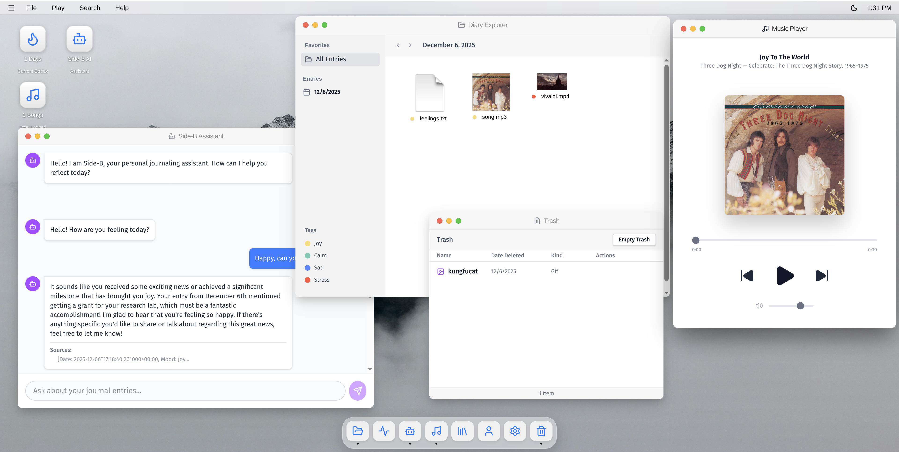

# Side-B: Multimedia Music Diary

Side-B is a next-generation journaling application that intertwines your thoughts with your music. By leveraging AI and a graph-based architecture, it provides deep insights into how your listening habits correlate with your emotional state.

## Features

*   **AI-Powered Journaling**: Write your daily thoughts and let our RAG (Retrieval-Augmented Generation) system help you reflect by recalling past entries and relevant context.
*   **Music Integration**: Seamlessly link songs from Deezer to your entries. The app analyzes the "vibe" of your text to recommend the perfect track.
*   **Visual Insights**: Explore your emotional and musical journey through interactive graphs powered by Dgraph. See how your moods connect to specific artists and genres.
*   **NoSQL**: Built on a robust architecture using:
    *   **MongoDB**: Flexible document storage for entries and users.
    *   **Cassandra**: High-speed write logging for user activity and stats.
    *   **Dgraph**: Knowledge graph for complex relationship mapping.
    *   **ChromaDB**: Vector database for semantic search and AI context.

##  Screenshots

### Landing Page


### Desktop


## Execution Instructions

### Prerequisites
*   **Docker & Docker Compose**: Required to run the database stack.
*   **Python 3.10+**: For the backend.
*   **Node.js 18+**: For the frontend.

### Quick Start
The easiest way to run the entire stack is using the helper script:

```bash
./run.sh
```

This script will:
1.  Start all databases via Docker Compose.
2.  Install backend dependencies and start the FastAPI server.
3.  Install frontend dependencies and start the React development server.

### Manual Setup

#### 1. Start Databases
```bash
docker-compose up -d
```

#### 2. Backend (FastAPI)
```bash
cd backend
python -m venv venv
source venv/bin/activate
pip install -r requirements.txt
uvicorn app.main:app --reload
```
*Server running at http://localhost:8000*

#### 3. Frontend (React)
```bash
cd frontend
npm install
npm run dev
```
*App running at http://localhost:5173*
